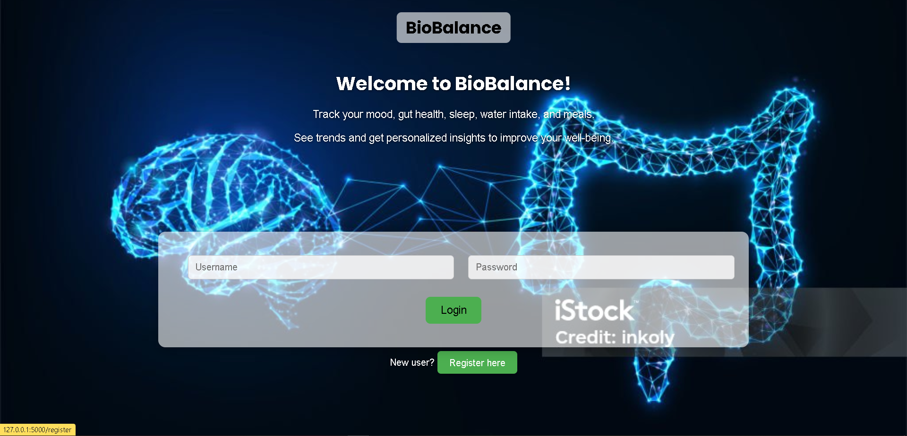
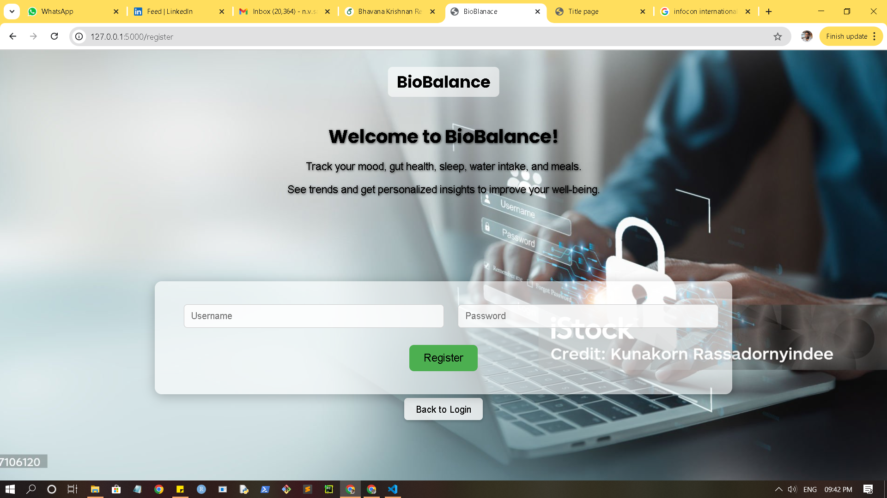
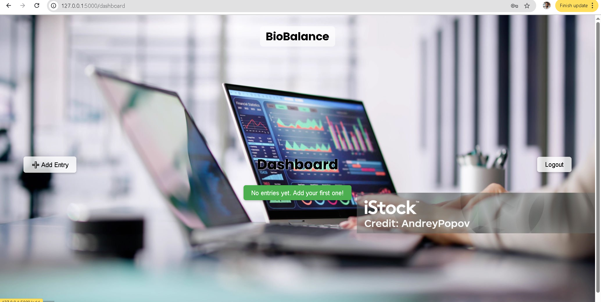
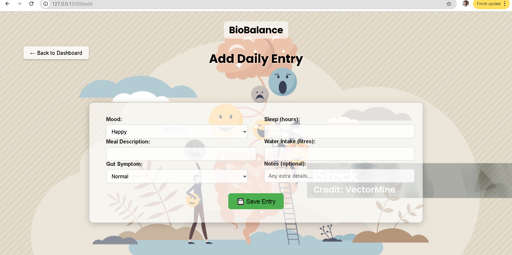

# BioBalance – Mood & Gut Tracker

**BioBalance** is a web application to track and visualize your **mood, gut health, sleep, water intake, and meals**. It generates personalized insights based on your entries to help you understand how lifestyle factors affect your well-being.

---

## **Features**

- Log your **mood, gut symptoms, sleep, water intake, and meals** daily
- View trends and correlations between lifestyle factors
- Personalized interpretations:
  > “Your mood tends to be better with more than 7 hours of sleep and over 2 liters of water.”
- Responsive design for desktops and mobile devices
- Secure login and registration system

---

## **Screenshots**






---

## **Technologies Used**

- Python 3.8+
- Flask – Web framework
- Jinja2 – Templating
- HTML, CSS, JavaScript
- Pandas & Statsmodels – For data analysis
- Plotly / Matplotlib (if used) – Graph generation

---

## **Installation**

1. Clone the repository:
   ```bash
   git clone <your-repo-url>
   cd <repo-folder>
````

2. Create a virtual environment:

   ```bash
   python -m venv venv
   source venv/bin/activate    # Linux/Mac
   venv\Scripts\activate       # Windows
   ```

3. Install dependencies:

   ```bash
   pip install -r requirements.txt
   ```

4. Run the Flask app:

   ```bash
   flask run
   ```

5. Open your browser at `http://127.0.0.1:5000/`

---

## **Project Structure**

```
BioBalance/
│
├─ app.py                # Main Flask app
├─ templates/
│   ├─ base.html
│   ├─ login.html
│   ├─ register.html
│   └─ dashboard.html
├─ static/
│   ├─ css/
│   ├─ images/
│   └─ js/
├─ requirements.txt
└─ README.md
```

---

## **Usage**

1. Register a new account
2. Login using your credentials
3. Add daily entries for mood, gut, sleep, water, and meals
4. View your dashboard for trends and insights

---

## **License**

This project is open source and available under the MIT License.
