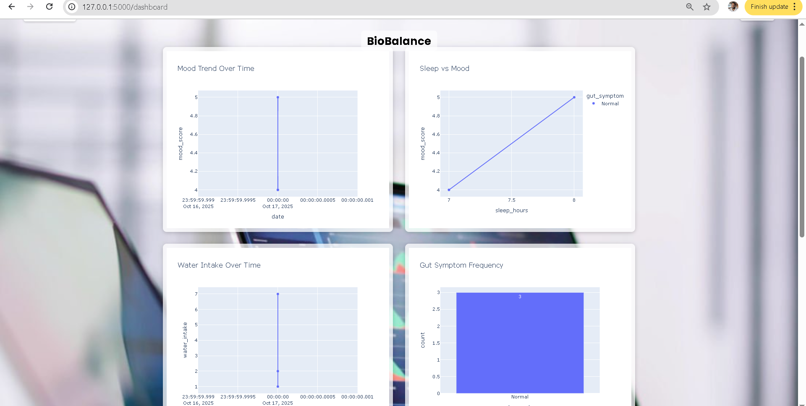

# BioBalance – Mood & Gut Tracker

**BioBalance** is a web application to track and visualize your **mood, gut health, sleep, water intake, and meals**. It generates personalized insights based on your entries to help you understand how lifestyle factors affect your well-being.

---

## **Features**

- Log your **mood, gut symptoms, sleep, water intake, and meals** daily
- View trends and correlations between lifestyle factors
- Personalized interpretations:
  > “Your mood tends to be better with more than 7 hours of sleep and over 2 liters of water.”
- Responsive design for desktops and mobile devices
- Secure login and registration system

---
## Screenshots




---

## **Technologies Used**

- Python 3.8+
- Flask – Web framework
- Flask-SQLAlchemy – ORM for database models
- HTML, CSS, Jinja2
- Pandas & Statsmodels – For data analysis
- Plotly – Graph generation

---

## **Installation**

1. Clone the repository:

   ```bash
   git clone git@github.com:Bhavana-Krishnan/BioBalance.git
   cd BioBalance
   ```

2. Create a virtual environment:

   ```bash
   python -m venv venv
   venv\Scripts\activate        # Windows
   # source venv/bin/activate   # Linux/Mac
   ```

3. Install dependencies:

   ```bash
   pip install -r requirements.txt
   ```

4. Run the app
   ```python
   python app.py   
   ```
5. Open your browser at `http://127.0.0.1:5000/`

---

## **Project Structure**

```
BioBalance/
│
├─ app.py                # Main Flask app
├─ models.py             # SQLAlchemy models
├─ moodgut.db             # db
├─ templates/
│   ├─ base.html
│   ├─ login.html
│   ├─ register.html
│   └─ dashboard.html
│   └─ add_entry.html
├─ static/
│   ├─ style.css
│   ├─ login.jpg
│   ├─ brain_gut_connected.jpg
│   ├─ brain_gut_link.jpg
│   ├─ dashboard.jpg
│   ├─ mood_gut.jpg
│   ├─ your_gut_your_mood.jpg
├─ requirements.txt
└─ README.md
├─ dashboard.png # Screenshot for README
├─ registration.png # Screenshot for README
└─ homepage.png # Screenshot for README
├─ empty_dashboard.png # Screenshot for README
├─ add_entry.png # Screenshot for README
```

---

## **Usage**

1. Register a new account
2. Login using your credentials
3. Add daily entries for mood, gut, sleep, water, and meals
4. View your dashboard for trends and insights

---

## **License**

This project is open source and available under the MIT License.
